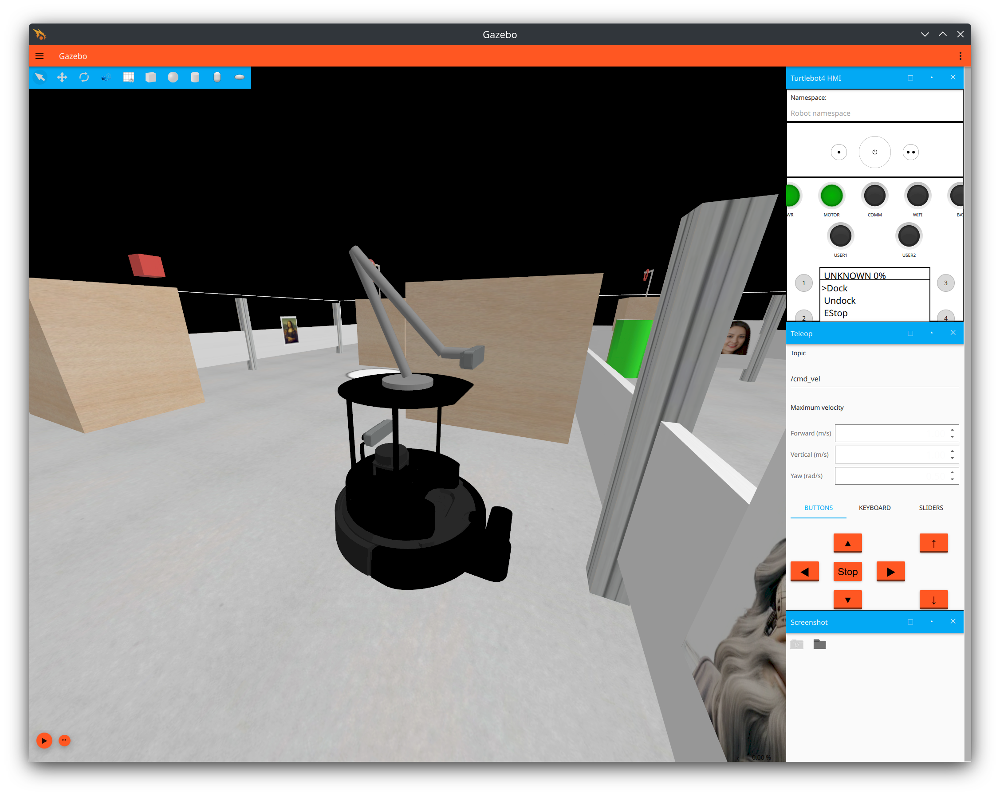

# Tutorial 7: Adding a robot arm and a camera to the Turtlebot4

#### Development of Inteligent Systems, 2024

This tutorial contains a modified robot, with an added robot arm with a camera. You can move the arm as you wish, placing the camera at a convinient position. This is mainly meant for the parking task and for reading the QR on top of the cylinder, but you are welcome to use it as you wish.


*You should see the robot in this configuration after starting the simulation*

## Install packages

All relevant control packages are most probably already installed on your computer. If not, we need the following packages in order for this modified version of the Turtlebot to work:
```
sudo apt install ros-humble-ros2-control ros-humble-ros2-controllers ros-humble-ign-ros2-control
```

## Start the simulation with the upgraded Turtlebot

After you have downloaded and built this package you can start the simulation with:

```
ros2 launch dis_tutorial7 sim_turtlebot_nav.launch.py
```
Once the simulation is running you can notice there is an additional camera on top of the robot, as in the above image. This camera can be accessed the same way the `oakd` camera is accessed (the same topics are available), but the prefix is `top_camera`. The arm is controlled by the `arm_controller` controller, which should be started after the `diffdrive_controller`. You can verify that the arm controller is working if, after unpausing the simulation, you see a printout in the terminal `[spawner_arm_controller]: Configured and activated arm_controller` as in the below image:


You can modify the launch file `sim_turtlebot_nav.launch.py` the same as the one in dis_tutorial3. The main difference is that this one loads a lot of the launch files from this packages, instead of the system installed ones. This is necessairy in order to load all the things we need to load for the robot arm to work.

## Setting the arm position

The node `arm_mover_actions.py` is a node that you can use to set the arm positon in a simple way. The node is communicating with the `arm_controller` through an action interface, just like we set a goal for the robot in the Nav2 stack (tutorials 3 and 4). You can include this node in some launch file, or start it with `ros2 run`:
```
ros2 run dis_tutorial7 arm_mover_actions.py
```

This node listens for a command of type `String` on the `/arm_command` topic. Currently, there are four approximate positions that are hard-coded:
```
self.arm_poses = {'look_for_parking':[0.,0.4,1.5,1.2],
                  'look_for_qr':[0.,0.6,0.5,2.0],
                  'garage':[0.,-0.45,2.8,-0.8],
                  'up':[0.,0.,0.,0.],
                  'manual':None}
```

This positions are approximate positions that might be suitable for different tasks. The "garage" position is for packing the arm so we do not hit something while driving the robot. The "up" position just sets all the joints to 0. The "look_for_parking" is a position that might be suitable for parking the robot, as seen in the below image. The "look_for_qr" position is a position that might be suitable for reading the QR code on top of the cyllinder. You are highly encouraged to modify these postions as you see fit! When you start the simulation the arm is in the 'garage' configuration. 

Configuration 'lood_for_parking'    |  The image from the topic
:-------------------------:|:-------------------------:
  |  

## Setting the arm position 'manually'
The last key in the dictionary - "manual" is there for debugging purposes, so that you are able to quicly test a configuration of the arm.

The position of the arm should be set from your code, and you can test the positions by using the 'ros2 topic' interface:
```
ros2 topic pub --once /arm_command std_msgs/msg/String "{data: garage}"
```
or
```
ros2 topic pub --once /arm_command std_msgs/msg/String "{data: look_for_parking}"
```
or
```
ros2 topic pub --once /arm_command std_msgs/msg/String "{data: look_for_qr}"
```

Be careful when using the "manual" keyword, as you can easily crash the node with the wrong format. To set a manual position send a `String` message in the format 'manual:[pos1, pos2, pos3, pos3]' where pos1-4 are floats (the numbers should contain a . ). For example:
```
ros2 topic pub --once /arm_command std_msgs/msg/String "{data: 'manual:[0.,0.6,0.5,2.0]'}"
```